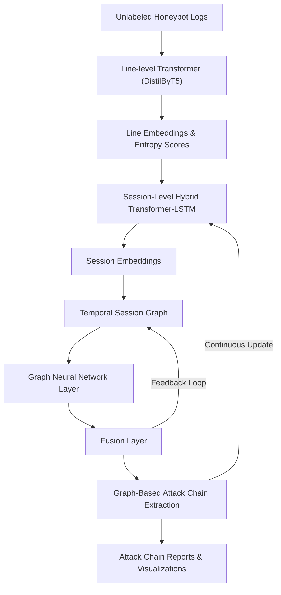

# Unsupervised Multi-Layer Anomaly Detection and Attack Chain Extraction in Unstructured Honeypot Logs  
*A Hybrid Deep Learning Framework for Modeling Complex Attacker Behavior on Unlabeled Production Data*  

## Introduction

The detection of anomalies and attack chain reconstruction in unstructured honeypot logs represents a complex challenge. Existing literature provides valuable inspiration but also exposes clear gaps. This document proposes a critically designed architecture and theoretical framework, leveraging the strengths and overcoming the weaknesses identified across recent state-of-the-art research.

## Critical Analysis of Related Work

- **DeepLog (2017)** and **AutoLog (2021)** effectively model log sequences but depend on structured templates or fail to address multi-session relationships.
- **LogBERT (2021)** introduces transformer-based models but lacks the capacity to handle unstructured, noisy, unlabeled logs and does not extend across sessions.
- **UNADA (2015)** and classical clustering methods are limited to NetFlow data or static metrics and lack adaptive, deep embedding-based models.
- **Raw Packet Data Ingestion with Transformers (2023)** demonstrates the feasibility of byte-level transformer modeling but encounters excessive computational overhead and training instability.
- **FedNIDS (2025)** illustrates the promise of federated learning but focuses on supervised paradigms and omits unsupervised detection.
- **Graph-based clustering** approaches remain underexplored for attack chain extraction, despite their intuitive fit for modeling temporal and relational dependencies.

## Proposed Architecture: Conceptual Design

### Key Innovations
- **Line-Level Modeling:** Use a lightweight distilled transformer (e.g., DistilByT5) for byte-level embeddings of log lines. This outperforms simple autoencoders in feature richness without requiring templates.
- **Session-Level Modeling:** Deploy a hybrid Transformer-LSTM module with temporal attention to capture both local (sequence-based) and global (contextual) session behavior.
- **Temporal Relationship Modeling:** Build dynamic session graphs, where nodes are session embeddings and edges represent temporal and semantic proximity.
- **Graph Neural Network Layer:** Integrate a GNN to learn over the session graph, capturing multi-hop relations and suspicious behavioral clusters.
- **Fusion Layer:** Combine line-level entropy scores, session-level anomaly signals, and GNN-based cluster embeddings into a unified anomaly score.
- **Graph-Based Attack Chain Extraction:** Leverage community detection or optimization-based clustering guided by the Cross-Session Anomaly Cohesion Score (CSACS).

### Is the Architecture Truly Linear?
In practice, the architecture is **not strictly linear**. While the conceptual flow diagram is presented sequentially for clarity, in reality:
- **Parallel processing** occurs between line-level embedding generation and session segmentation.
- **Iterative refinement** loops may feed anomaly signals back into the graph to adjust edge weights dynamically.
- The **GNN layer** and clustering steps may operate on dynamically updated graphs in near real-time.
- The **fusion layer** aggregates signals from different components asynchronously, allowing for late binding of information.
- Feedback loops and adaptive updates (possibly even federated training elements) will make the system cyclical rather than purely top-down.

Thus, the real system is better conceptualized as a dynamic ecosystem of modules with feedback and parallelization rather than a linear pipeline.

### Proposed Architecture Diagram (Conceptual Overview)

## Mathematical Background

### Problem Setup
- Honeypot log lines:
$$L = \{l_1, l_2, ..., l_n\}$$
- Grouped into sessions:
$$S = \{s_1, s_2, ..., s_m\}$$
- Each log line maps to an embedding:
$$\mathbf{e}_{l_i} \in \mathbb{R}^d$$
- Session embeddings are derived from the final state of the Transformer-LSTM stack:
$$\mathbf{e}_{s_i} = \text{TransformerLSTM}(s_i)$$

### Cross-Session Anomaly Cohesion Score (CSACS)
$$
\text{CSACS}(C) = \frac{ \sum_{(s_i, s_j) \in E_C} \left( \lambda_1 \cdot \frac{1}{D(s_i, s_j) + \epsilon} + \lambda_2 \cdot \frac{1}{T(s_i, s_j) + \delta} \right) \cdot \min(A(s_i), A(s_j)) }{ |E_C| }
$$

Where:
- $E_C$ = set of edges in cluster $C$
- $D(s_i, s_j)$ = embedding distance
- $T(s_i, s_j)$ = temporal gap
- $A(s_i)$ = session anomaly score
- $\lambda_1, \lambda_2$ = tunable parameters
- $\epsilon, \delta$ = smoothing constants

### Optimization Objective
$$
\max_{C} \text{CSACS}(C) - \gamma \cdot |C|
$$
- Balancing cluster quality with regularization.

### Hypothetical Stability Theorem (Conceptual Proposal)
**Theorem:** Under Gaussian noise and uniform temporal distribution, the probability of a random cluster exceeding threshold $\theta$ decreases exponentially with edge count:
$$
P(\text{CSACS}(C) \geq \theta) \leq \exp(-\alpha \cdot |E_C| \cdot \theta)
$$
- $\alpha > 0$ relates to noise variance.
- Requires future empirical proof.

## Limitations and Critical Reflection
- Transformer-based methods may suffer from scalability constraints.
- Parameter selection ($\lambda_1, \lambda_2, \gamma$) and training stability remain open challenges.
- Graph construction and continuous updates can introduce computational overhead.
- The linear diagram is a conceptual simplification; real-world deployment is inherently cyclical and asynchronous.

## Conclusion
This framework merges the most powerful ideas from the literature into a dynamic, non-linear system for anomaly detection and attack chain reconstruction. It provides a robust theoretical and practical foundation, with the flexibility for future adaptations, real-time updates, and federated learning extensions.

