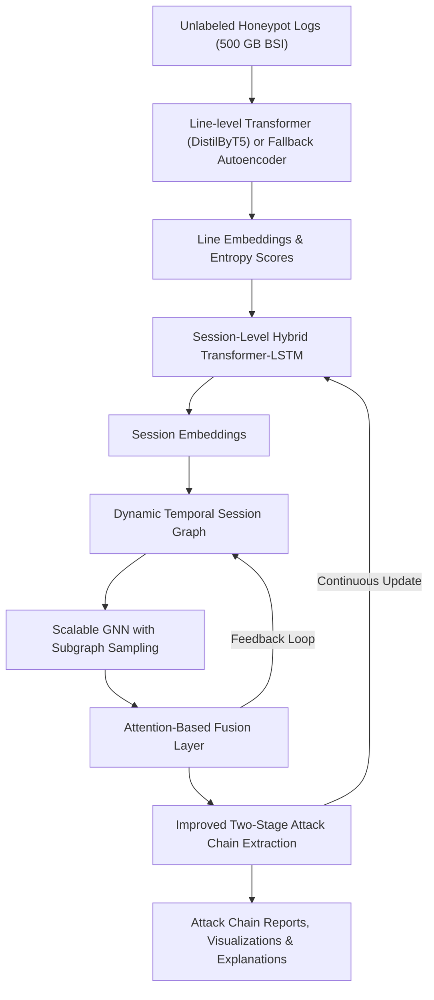

# Unsupervised Multi-Layer Anomaly Detection and Attack Chain Extraction in Unstructured Honeypot Logs
*A Hybrid Deep Learning Framework for Modeling Complex Attacker Behavior on Unlabeled Production Data*

## Related Work and Positioning
This framework builds upon and addresses gaps identified in state-of-the-art research, including:
- **An Unsupervised Deep Learning Model for Early Network Traffic Anomaly Detection (2020)**: CNN combined with autoencoders for early anomaly detection on IoT traffic, using only the first bytes of flows for fast detection.
- **Anomaly Detection from Log Files Using Unsupervised Deep Learning (2020)**: LSTM autoencoder applied to raw, unstructured log data without preprocessing; relevant for modeling temporal rarity signals.
- **DeepLog (2017)**: LSTM-based modeling of structured system log sequences, with incremental updates but limited to single-session and structured data.
- **AutoLog (2021)**: Template-free deep autoencoder using entropy scoring, effective on heterogeneous system logs, but lacking relational modeling across sessions.
- **Raw Packet Data Ingestion with Transformers (2023)**: Byte-level transformer ingestion of raw packet data; demonstrates feasibility but faces large infrastructure demands.
- **Unsupervised Machine Learning Techniques for Network Intrusion Detection (2020)**: Comparison of PCA, Isolation Forest, One-Class SVM, and autoencoders; highlights autoencoders' superiority for zero-day detection and real-time efficiency.
- **A Deep Learning Approach to Network Intrusion Detection (2017)**: Stacked non-symmetric autoencoders with random forest classifiers; foundational for hybrid feature extraction and classification.
- **An LSTM-Based Deep Learning Approach for Packet-Level Detection (2020)**: Embedding of packet header fields for sequence-based anomaly detection, pointing out limitations in generalizing to payloads.
- **UNADA (2015)**: Clustering-based unsupervised anomaly detection in honeypot traffic with automated signature generation; limited to NetFlow data.
- **FedNIDS (2025)**: Federated supervised learning on packet data; excellent scalability, but lacks unsupervised adaptability for unknown attacks.
- **DeepFed (2023)**: Federated, unsupervised deep anomaly detection across unlabeled data streams, relevant for future decentralized security models.
- **Graph Neural Networks for Anomaly Detection in Dynamic Graphs (2022)**: Reviews scalability strategies and temporal GNN frameworks applicable to dynamic honeypot graph construction.
- **Online and Adaptive Graph Construction for Anomaly Detection (2022)**: Introduces dynamic graph edge adaptation mechanisms based on anomaly scores and time decay.
- **Explainable AI for Anomaly Detection in Cybersecurity (2023)**: Provides guidance on integrating GNN explainability techniques like GNNExplainer and interpretability for security analysts.

## Introduction
The detection of anomalies and attack chain reconstruction in unstructured honeypot logs represents a complex challenge. Existing literature provides valuable inspiration but also exposes clear gaps. This document proposes a critically designed architecture and theoretical framework, leveraging the strengths and overcoming the weaknesses identified across recent state-of-the-art research.

Given the large-scale nature of production honeypot data, this paper primarily focuses on an unlabeled 500 GB dataset provided by the BSI (German Federal Office for Information Security). Its size and lack of labels motivate a fully unsupervised approach. For further validation and partial ground-truth checks, classical intrusion datasets such as **KDD Cup 99** and **NSL-KDD** can be leveraged. This combination enables comprehensive benchmarking: the BSI dataset tests scalability and real-world complexity, while the labeled sets confirm detection accuracy on known attack types.

## Proposed Architecture: Enhanced Conceptual Design

### Key Innovations
- **Line-Level Modeling:** Use a lightweight distilled transformer (e.g., DistilByT5) for byte-level embeddings of log lines. To ensure scalability, introduce a fallback denoising sequence autoencoder that can replicate transformer-based embeddings in high-throughput production environments.
- **Session-Level Modeling:** Deploy a hybrid Transformer-LSTM module with temporal attention to capture both local (sequence-based) and global (contextual) session behavior.
- **Temporal Relationship Modeling:** Build dynamic session graphs with clear construction logic: edge weights are defined by a combination of semantic distance and temporal proximity with exponential decay. Only edges above a defined percentile threshold are retained.
- **Graph Neural Network Layer:** Integrate a scalable GNN using subgraph sampling techniques (such as GraphSAGE or Cluster-GCN) to learn over the session graph without overwhelming memory.
- **Fusion Layer:** Design the fusion layer as a multi-input attention mechanism, weighting line-level entropy scores, session-level anomaly signals, and GNN-based cluster embeddings. Include ablation studies to optimize this fusion mechanism.
- **Improved Attack Chain Extraction:** Implement a two-stage process — temporal clustering (via DBSCAN on timestamp embeddings) followed by community detection (Leiden algorithm) within each cluster to improve stability and accuracy.
- **Explainability:** Incorporate an explainability module using GNNExplainer and heatmaps to highlight the most influential lines and sessions. Additionally, visualize attack chains and cluster structures for analyst consumption.

### Updated Architecture Diagram (Conceptual Overview)

## Mathematical Background

### Problem Setup
- Honeypot log lines:
$$ L = \{l_1, l_2, \dots, l_n\} $$
- Grouped into sessions:
$$ S = \{s_1, s_2, \dots, s_m\} $$
- Each log line maps to an embedding:
$$ e_{l_i} \in \mathbb{R}^d $$
- Session embeddings are derived from the final state of the Transformer-LSTM stack:
$$ e_{s_i} = \text{TransformerLSTM}(s_i) $$

### Cross-Session Anomaly Cohesion Score (CSACS)
$$
CSACS(C) = \frac{ \sum_{(s_i, s_j) \in E_C} \left( \lambda_1 \cdot \frac{1}{D(s_i, s_j) + \epsilon} + \lambda_2 \cdot \frac{1}{T(s_i, s_j) + \delta} \right) \cdot \min(A(s_i), A(s_j)) }{ |E_C| }
$$

**Where:**
- $E_C$: set of edges in cluster $C$
- $D(s_i, s_j)$: embedding distance
- $T(s_i, s_j)$: temporal gap
- $A(s_i)$: anomaly score of session $s_i$
- $\lambda_1, \lambda_2$: tunable weighting parameters
- $\epsilon, \delta$: smoothing constants

### Optimization Objective
$$
\max_{C} CSACS(C) - \gamma \cdot |C|
$$
- With $\gamma$ as a regularization term balancing cluster compactness and size.

### Hypothetical Stability Theorem (Conceptual Proposal)
**Theorem:** Under Gaussian noise and uniform temporal distribution assumptions, the probability that a random cluster exceeds threshold $\theta$ decays exponentially with the number of edges:
$$
P(CSACS(C) \geq \theta) \leq \exp\left(-\alpha \cdot |E_C| \cdot \theta\right)
$$
- $\alpha > 0$ depends on the noise variance.
- Future mathematical proof and empirical validation are required.

## Data Strategy, Implementation, and Evaluation Plan

To demonstrate feasibility, we plan to evaluate this approach on:
1. **Unlabeled 500 GB BSI Honeypot Dataset**: Large, real-world, and unstructured. Ideal for testing scalability and unsupervised capabilities. We will measure anomaly detection coverage, throughput (logs/sec), and resource usage (CPU/GPU memory) in near real-time ingestion pipelines.
2. **KDD Cup 99 / NSL-KDD**: Classic labeled intrusion datasets. Although dated, they help us establish performance baselines and partially validate detection metrics (precision, recall, F1) on known attack classes.

### Ablation Studies
We will systematically compare:
- **Transformer vs. Autoencoder** for line-level embedding.
- **Full Session Model vs. No Session Model** to confirm the need for capturing cross-line context.
- **Static vs. Dynamic Graph** construction thresholds.
- **GNN vs. simpler aggregator** (e.g., MLP) to measure the GNN’s benefit on multi-session correlation.
- **Fusion vs. single anomaly score** to highlight synergy among line-level, session-level, and GNN-based signals.

### Real-Time Constraints and Overhead Mitigation
- We employ **subgraph sampling** (GraphSAGE/Cluster-GCN) and **mini-batch training** to keep memory usage stable.
- The fallback autoencoder can replace the transformer for continuous ingestion on commodity servers when resource constraints are high.
- Asynchronous pipelines and approximate nearest neighbor queries accelerate graph construction for large data volumes.

### Explainability Demonstration
- We plan to highlight case studies from the BSI dataset, where suspicious clusters are found. Analysts can see GNNExplainer visuals, line-level anomaly heatmaps, and a timeline-based chain reconstruction.
- Comparisons to simpler feature-based methods (e.g., Isolation Forest) will help show how deeply learned embeddings reveal complex attacker behavior that rule-based systems miss.

## Refined Limitations and Future Work
- **Hyperparameter Tuning**: Finding suitable thresholds, weights ($\lambda_1, \lambda_2, \gamma$), and subgraph sampling rates requires iterative experimentation.
- **Irregular Temporal Patterns**: Some attacks may exhibit long dormant phases. We plan to incorporate an adaptive decay function or rolling time windows.
- **Large-Scale Real-Time**: Even with fallback and sampling, extremely large ingestion rates demand distributed architectures. We will explore parallel graph-building and cluster algorithms.
- **Partial Labeling & Ground Truth**: While our BSI dataset is unlabeled, we plan to integrate known labeled segments or curated subsets. This also supports semi-supervised expansions and evaluation.

## Conclusion
This enhanced framework integrates fallback autoencoders, scalable graph learning techniques, well-defined temporal graph construction, advanced fusion mechanisms, improved attack chain extraction methods, and robust explainability components. With the availability of a massive 500 GB unlabeled honeypot dataset from the BSI, plus smaller labeled benchmarks like KDD Cup 99 and NSL-KDD, we can thoroughly demonstrate both scalability and accuracy. These improvements solidify the architecture’s potential for publication and practical deployment while paving the way for future work in real-time, federated, and adaptive threat intelligence systems.

