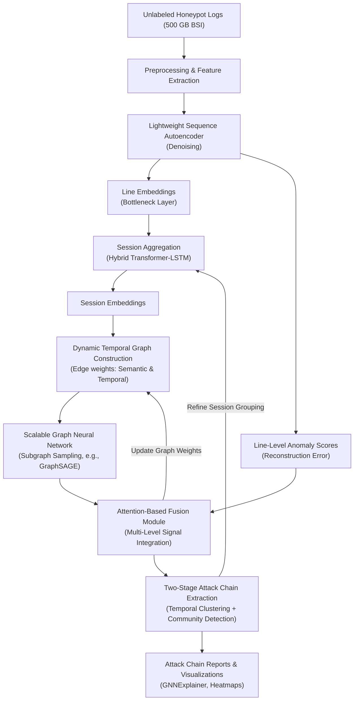

# Unsupervised Multi-Layer Anomaly Detection and Attack Chain Extraction in Unstructured Honeypot Logs
*A Hybrid Deep Learning Framework for Modeling Complex Attacker Behavior on Unlabeled Production Data*

---
This concept is created with help from Generative AI (ChatGpt o1 + 4o)

---

## 1. Related Work and Positioning
This framework builds upon and addresses gaps identified in state-of-the-art research, including:

- **An Unsupervised Deep Learning Model for Early Network Traffic Anomaly Detection (2020)**: CNN combined with autoencoders for early anomaly detection on IoT traffic, using only the first bytes of flows for fast detection.  
- **Anomaly Detection from Log Files Using Unsupervised Deep Learning (2020)**: LSTM autoencoder applied to raw, unstructured log data without preprocessing; relevant for modeling temporal rarity signals.  
- **DeepLog (2017)**: LSTM-based modeling of structured system log sequences, with incremental updates but limited to single-session and structured data.  
- **AutoLog (2021)**: Template-free deep autoencoder using entropy scoring, effective on heterogeneous system logs, but lacking relational modeling across sessions.  
- **Raw Packet Data Ingestion with Transformers (2023)**: Byte-level transformer ingestion of raw packet data; demonstrates feasibility but faces large infrastructure demands.  
- **Unsupervised Machine Learning Techniques for Network Intrusion Detection (2020)**: Comparison of PCA, Isolation Forest, One-Class SVM, and autoencoders; highlights autoencoders' superiority for zero-day detection and real-time efficiency.  
- **A Deep Learning Approach to Network Intrusion Detection (2017)**: Stacked non-symmetric autoencoders with random forest classifiers; foundational for hybrid feature extraction and classification.  
- **An LSTM-Based Deep Learning Approach for Packet-Level Detection (2020)**: Embedding of packet header fields for sequence-based anomaly detection, pointing out limitations in generalizing to payloads.  
- **UNADA (2015)**: Clustering-based unsupervised anomaly detection in honeypot traffic with automated signature generation; limited to NetFlow data.  
- **FedNIDS (2025)**: Federated supervised learning on packet data; excellent scalability, but lacks unsupervised adaptability for unknown attacks.  
- **DeepFed (2023)**: Federated, unsupervised deep anomaly detection across unlabeled data streams, relevant for future decentralized security models.  
- **Graph Neural Networks for Anomaly Detection in Dynamic Graphs (2022)**: Reviews scalability strategies and temporal GNN frameworks applicable to dynamic honeypot graph construction.  
- **Online and Adaptive Graph Construction for Anomaly Detection (2022)**: Introduces dynamic graph edge adaptation mechanisms based on anomaly scores and time decay.  
- **Explainable AI for Anomaly Detection in Cybersecurity (2023)**: Provides guidance on integrating GNN explainability techniques like GNNExplainer and interpretability for security analysts.

---

## 2. Introduction
The detection of anomalies and the reconstruction of attack chains in unstructured honeypot logs represent a complex challenge. Existing literature provides valuable inspiration but also exposes clear gaps—particularly in handling massive, unlabeled datasets and detecting multi-session or long-tail attacks. This document proposes a critically designed architecture and theoretical framework that leverages the strengths and addresses the weaknesses identified across recent state-of-the-art research.

Given the large-scale nature of production honeypot data, this paper primarily focuses on an unlabeled 500 GB dataset provided by the BSI (German Federal Office for Information Security). Its considerable size and lack of any explicit ground truth motivate a fully unsupervised approach. For further validation and partial ground-truth checks, classical intrusion datasets such as **KDD Cup 99** and **NSL-KDD** will be leveraged. This combination enables comprehensive benchmarking: the BSI dataset tests scalability and real-world complexity, while the smaller labeled sets confirm detection accuracy on known attack classes.

---

## 3. Proposed Architecture: Enhanced Conceptual Design

### 3.1 Key Innovations
(1) **Line-Level Modeling**  
Use a lightweight denoising sequence autoencoder for byte-level embeddings of log lines. This autoencoder simultaneously provides a line embedding vector (from the bottleneck layer) and a reconstruction error as an anomaly score.

(2) **Session-Level Modeling**  
Deploy a hybrid Transformer-LSTM module with temporal attention to capture both local (sequence-based) and global (contextual) session behavior. This layer aggregates line embeddings into a coherent session representation, accounting for potential long-range dependencies and ordering.

(3) **Temporal Relationship Modeling**  
Construct dynamic session graphs in which edges reflect semantic distance and temporal adjacency, decaying exponentially over time. This approach helps identify how different sessions are interlinked, uncovering multi-session attack sequences or correlated anomalies.

(4) **Graph Neural Network Layer**  
Integrate a scalable GNN using subgraph sampling techniques (e.g., GraphSAGE or Cluster-GCN) to handle large, evolving graphs without overwhelming memory. This layer consolidates session embeddings and uncovers global patterns indicative of distributed or advanced persistent threats (APTs).

(5) **Fusion Layer**  
Design an attention-based fusion mechanism that combines:  

  - **Line-level anomaly scores** (reconstruction error from the autoencoder),  
  - **Session-level anomaly indicators**,  
  - **GNN-based cluster embeddings**.  
  
   By weighting these factors, the fusion layer seeks a comprehensive anomaly indicator reflective of local outliers and global relational structure.

(6) **Improved Attack Chain Extraction**  
Implement a two-stage process—first, coarse temporal clustering (via DBSCAN on timestamp embeddings) to group sessions that lie close in time, followed by fine-grained community detection (e.g., Leiden algorithm) to identify subgroups with high anomaly cohesion. This helps reconstruct potentially large, multi-step attack chains spanning many sessions.

(7) **Explainability**  
Incorporate GNNExplainer for subgraph-level interpretability and heatmaps showing the most significant lines or sessions in an anomalous cluster. By mapping the contributing features back to raw log lines, security analysts can trace suspicious activity with minimal manual overhead.

### 3.2 Updated Architecture Diagram (Conceptual Overview)

---

## 4. Mathematical Background

### 4.1 Problem Setup
- **Honeypot Log Lines**  
  $$
    L = \{l_1, l_2, \dots, l_n\}
  $$  
- **Grouped into Sessions**  
  $$
    S = \{s_1, s_2, \dots, s_m\}
  $$  
- **Per-Line Embeddings**  
  $$
    e_{l_i} \in \mathbb{R}^d
  $$  
  Each log line is mapped to a continuous vector representation.  
- **Session Embeddings**  
  Derived from the final state of the Transformer-LSTM stack:  
  $$
    e_{s_i} = \text{TransformerLSTM}(s_i)
  $$

### 4.2 Cross-Session Anomaly Cohesion Score (CSACS)
To quantify how anomalous and tightly coupled a community \( C \) of sessions is, we propose:

$$
  CSACS(C) = \frac{ \sum_{(s_i, s_j) \in E_C} \left( \lambda_1 \cdot \frac{1}{D(s_i, s_j) + \epsilon} + \lambda_2 \cdot \frac{1}{T(s_i, s_j) + \delta} \right) \cdot \min(A(s_i), A(s_j)) }{ |E_C| }
$$

**Where**:

- \( E_C \): set of edges among sessions in community \( C \)  
- \( D(s_i, s_j) \): distance between session embeddings \( e_{s_i} \) and \( e_{s_j} \)  
- \( T(s_i, s_j) \): temporal gap between sessions  
- \( A(s_i) \): anomaly score of session \( s_i \)  
- \( \lambda_1, \lambda_2 \): weighting parameters  
- \( \epsilon, \delta \): small constants for numerical stability  

### 4.3 Optimization Objective
$$
  \max_{C} \; CSACS(C) \;-\; \gamma \cdot |C|
$$
Balancing cluster compactness and size through a regularization term \(\gamma\).

### 4.4 Hypothetical Stability Theorem (Conceptual Proposal)
> **Theorem:** Under Gaussian noise and uniform temporal distribution assumptions, the probability that a random cluster exceeds threshold \(\theta\) decays exponentially with the number of edges:  
> $$
>   P(CSACS(C) \geq \theta) \;\leq\; \exp\Bigl(-\alpha \cdot |E_C| \cdot \theta\Bigr),
> $$  
> where \(\alpha > 0\) depends on the noise variance.  
> **Note:** A full proof is out of scope for this paper, but future work will involve both theoretical and empirical analysis to validate or refine this statement.

---

## 5. Data Strategy, Implementation, and Evaluation Plan

### 5.1 Datasets

1. **Unlabeled 500 GB BSI Honeypot Dataset**  

    - Large-scale, real-world, unstructured data.  
    - Ideal for testing scalability and unsupervised capabilities on production-level volumes.  
    - We will measure detection coverage, throughput (logs/sec), and resource usage (CPU/GPU memory) in near real-time pipelines.

2. **KDD Cup 99 / NSL-KDD**  

    - Classic labeled intrusion datasets, albeit somewhat dated.  
    - Useful for establishing performance baselines (Precision, Recall, F1).  
    - Provides partial ground truth and confirms whether the system can detect well-known attacks.

### 5.2 Ablation Studies and Comparative Experiments
We propose **five** key ablations to rigorously test each major architectural component:

1. **Autoencoder vs. Transformer (historical reference)**  

    - **Hypothesis:** Although Transformer embeddings could be more expressive, a well-trained autoencoder provides a robust and scalable alternative with anomaly scoring capability.  
    - **Metrics:** Reconstruction error, classification metrics (where labels exist), ingestion throughput.

2. **Full Session Model vs. No Session Model**  

    - **Setup:** Compare a pipeline that (a) aggregates log lines into sessions vs. (b) treats every line independently before the GNN.  
    - **Aim:** Check if ignoring session context severely diminishes anomaly detection for multi-step attacks.

3. **Static vs. Dynamic Graph Construction**  

    - **Variant A:** Build a static graph for a fixed time window.  
    - **Variant B:** Continuously update edges with an exponential time decay.  
    - **Goal:** Evaluate whether dynamic adjacency provides better chain detection for persistent or slow-moving attacks.

4. **GNN vs. Simpler Aggregator**  

    - **Comparison:** Replace the GNN with a basic aggregator (e.g., an MLP on session embeddings or a clustering method like k-Means).  
    - **Question:** Is the complexity of a GNN justified by significantly better correlation of anomalies across sessions?

5. **Fusion vs. Single Anomaly Score**  

    - **Approach:** Compare using a single anomaly score (e.g., from the session model only) vs. combining line-level, session-level, and GNN-based signals in the fusion layer.  
    - **Objective:** Demonstrate whether multi-level fusion substantially improves detection robustness and reduces false positives.

### 5.3 Real-Time Constraints and Overhead Mitigation
- **Subgraph Sampling & Mini-batch Training**: Techniques like GraphSAGE or Cluster-GCN prevent memory overflow by processing only portions of the graph at each step.  
- **Fallback Autoencoder**: Serves as both feature generator and anomaly scorer with minimal overhead.  
- **Asynchronous Pipelines & Approximate Queries**: Use approximate nearest neighbor (ANN) for faster edge construction among sessions and decouple embedding computation from graph updates for better parallelization.

### 5.4 Explainability Demonstration
- **Case Studies on BSI Dataset**: Highlight suspicious clusters identified by the system, visualizing subgraphs with GNNExplainer.  
- **Line-Level Heatmaps**: Provide interpretability for local anomalies, showing which tokens or segments in a log line contributed most to the anomaly score.  
- **Comparison to Baselines**: Methods like Isolation Forest or simpler autoencoders will be used to illustrate how deeper embedding and graph-based context capture more complex attack patterns.

---
