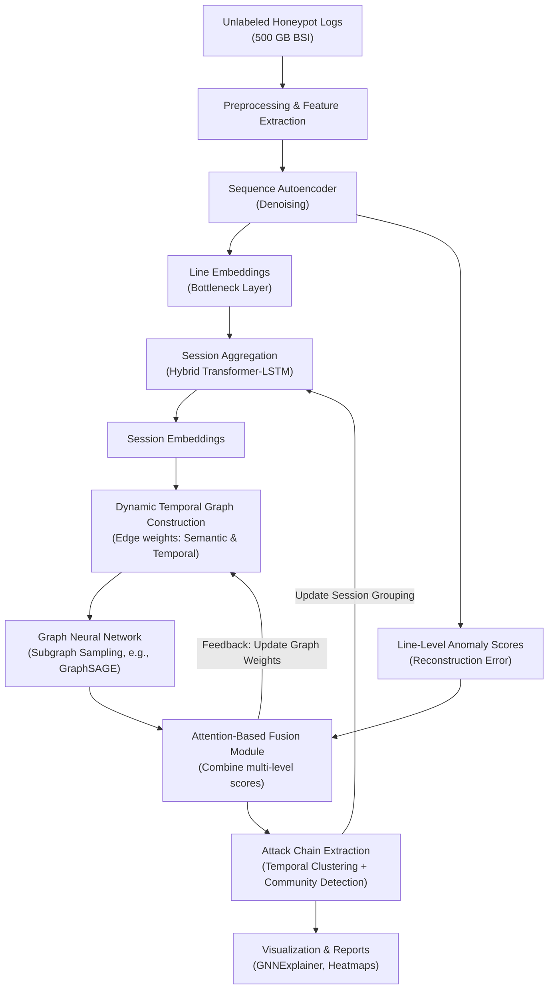

# Unsupervised Multi-Layer Anomaly Detection and Attack Chain Extraction in Unstructured Honeypot Logs  
*A Hybrid Deep Learning Framework for Modeling Complex Attacker Behavior on Unlabeled Production Data*

---
This concept is created with help from Generative AI (ChatGPT o1 + 4o)

---

## 1. Related Work and Positioning
This framework builds upon and addresses gaps identified in state-of-the-art research, including:

- **An Unsupervised Deep Learning Model for Early Network Traffic Anomaly Detection (2020):**  
  Combines CNNs with autoencoders for early anomaly detection on IoT traffic using only the first bytes of flows, enabling fast detection.
- **Anomaly Detection from Log Files Using Unsupervised Deep Learning (2020):**  
  Applies LSTM autoencoders to raw, unstructured log data without extensive preprocessing; relevant for modeling temporal rarity signals.
- **DeepLog (2017):**  
  Uses LSTM-based modeling of structured system log sequences with incremental updates, but is limited to single-session and structured data.
- **AutoLog (2021):**  
  Introduces a template-free deep autoencoder using entropy scoring effective on heterogeneous system logs, yet lacking relational modeling across sessions.
- **Raw Packet Data Ingestion with Transformers (2023):**  
  Demonstrates byte-level transformer ingestion of raw packet data; shows feasibility at high cost in terms of infrastructure.
- **Unsupervised Machine Learning Techniques for Network Intrusion Detection (2020):**  
  Compares PCA, Isolation Forest, One-Class SVM, and autoencoders, highlighting autoencoders' superiority for zero-day detection and real-time efficiency.
- **A Deep Learning Approach to Network Intrusion Detection (2017):**  
  Utilizes stacked non-symmetric autoencoders with random forest classifiers; foundational for hybrid feature extraction and classification.
- **An LSTM-Based Deep Learning Approach for Packet-Level Detection (2020):**  
  Embeds packet header fields for sequence-based anomaly detection, with limitations when generalizing to payload data.
- **UNADA (2015):**  
  Uses clustering-based unsupervised anomaly detection in honeypot traffic with automated signature generation, yet is limited to NetFlow data.
- **FedNIDS (2025):**  
  Implements federated supervised learning on packet data, offering excellent scalability but lacking unsupervised adaptability for unknown attacks.
- **DeepFed (2023):**  
  Proposes federated, unsupervised deep anomaly detection across unlabeled data streams, relevant for future decentralized security models.
- **Graph Neural Networks for Anomaly Detection in Dynamic Graphs (2022):**  
  Reviews scalability strategies and temporal GNN frameworks applicable to dynamic honeypot graph construction.
- **Online and Adaptive Graph Construction for Anomaly Detection (2022):**  
  Introduces dynamic graph edge adaptation mechanisms based on anomaly scores and time decay.
- **Explainable AI for Anomaly Detection in Cybersecurity (2023):**  
  Provides guidance on integrating GNN explainability techniques like GNNExplainer, enhancing interpretability for security analysts.

---

## 2. Introduction
The detection of anomalies and reconstruction of attack chains in unstructured honeypot logs represents a complex challenge. Existing literature offers valuable inspiration but also exposes clear gaps—particularly when handling massive, unlabeled datasets and detecting multi-session or long-tail attacks. 

This document proposes a critically designed architecture and theoretical framework that:
- Leverages **line-level** and **session-level** deep learning models,
- Constructs **dynamic temporal graphs** to represent inter-session relationships, and
- Employs **graph neural networks (GNNs)** to uncover distributed attack patterns.

Given the large-scale nature of production honeypot data, our focus is on an unlabeled 500 GB dataset provided by the BSI (German Federal Office for Information Security). Its considerable size and lack of explicit ground truth necessitate a fully unsupervised approach. For validation and partial ground-truth checks, classic intrusion datasets such as **KDD Cup 99** and **NSL-KDD** will be leveraged. This combination facilitates comprehensive benchmarking: the BSI dataset tests scalability and real-world complexity, while the labeled sets confirm detection accuracy on known attack classes.

---

## 3. Proposed Architecture: Enhanced Conceptual Design

### 3.1 Key Innovations

1. **Line-Level Modeling**  
   - **Lightweight Sequence Autoencoder:**  
     Process individual log lines as byte sequences using a denoising autoencoder.  
     - Each log line $l_i$ is mapped to an embedding vector $e_{l_i} \in \mathbb{R}^d$ from the bottleneck layer.
     - The reconstruction error serves as a line-level anomaly score.

2. **Session-Level Modeling**  
   - **Hybrid Transformer-LSTM Module:**  
     Aggregate sequential log line embeddings into coherent session representations $e_{s_i}$, capturing both local (short-term) and global (long-range) dependencies.
   - **Temporal Attention Mechanism:**  
     Enhances the model's ability to weigh significant events in a session based on their temporal context.

3. **Temporal Relationship Modeling**  
   - **Dynamic Session Graphs:**  
     Construct graphs where each node represents a session, and edges reflect both semantic distance $D(s_i, s_j)$ between session embeddings and temporal proximity $T(s_i, s_j)$, with an exponential decay factor to prioritize recent correlations.

4. **Graph Neural Network Layer**  
   - **Scalable GNNs:**  
     Employ subgraph sampling techniques (e.g., GraphSAGE or Cluster-GCN) to process large, evolving graphs efficiently, consolidating session embeddings to detect distributed or persistent threats.

5. **Fusion Layer**  
   - **Attention-Based Fusion Mechanism:**  
     Combine:
       - Line-level anomaly scores,
       - Session-level anomaly indicators, and
       - GNN-based cluster embeddings.
     This fusion yields a comprehensive anomaly indicator that reflects both local and global patterns.

6. **Improved Attack Chain Extraction**  
   - **Two-Stage Process:**
     1. **Coarse Temporal Clustering:**  
        Use methods like DBSCAN on timestamp embeddings to group sessions that are temporally adjacent.
     2. **Fine-Grained Community Detection:**  
        Apply community detection algorithms (e.g., the Leiden algorithm) to identify subgroups with high anomaly cohesion, effectively reconstructing multi-step attack chains.

7. **Explainability**  
   - **GNNExplainer and Heatmaps:**  
     Generate interpretable subgraph-level explanations and line-level heatmaps to highlight which features or log tokens most contributed to the anomaly score, aiding security analysts in quickly understanding suspicious activity.

### 3.2 Updated Architecture Diagram (Conceptual Overview)

---

## 4. Mathematical Background

### 4.1 Problem Setup
- **Honeypot Log Lines:**  
  $$
    L = \{l_1, l_2, \dots, l_n\}
  $$
- **Grouped into Sessions:**  
  $$
    S = \{s_1, s_2, \dots, s_m\}
  $$
- **Per-Line Embeddings:**  
  $$
    e_{l_i} \in \mathbb{R}^d
  $$
- **Session Embeddings:**  
  Obtained via a hybrid model:
  $$
    e_{s_i} = \text{TransformerLSTM}(s_i)
  $$

### 4.2 Cross-Session Anomaly Cohesion Score (CSACS)
To quantify the anomaly cohesion of a community \( C \) of sessions:
$$
  CSACS(C) = \frac{ \sum_{(s_i, s_j) \in E_C} \left( \lambda_1 \cdot \frac{1}{D(s_i, s_j) + \epsilon} + \lambda_2 \cdot \frac{1}{T(s_i, s_j) + \delta} \right) \cdot \min\bigl(A(s_i), A(s_j)\bigr) }{ |E_C| }
$$

**Where:**
- \( E_C \) is the set of edges among sessions in community \( C \),
- \( D(s_i, s_j) \) is the distance between session embeddings \( e_{s_i} \) and \( e_{s_j} \),
- \( T(s_i, s_j) \) is the temporal gap between sessions,
- \( A(s_i) \) is the anomaly score of session \( s_i \),
- \( \lambda_1, \lambda_2 \) are weighting parameters,
- \( \epsilon, \delta \) are small constants for numerical stability.

### 4.3 Optimization Objective
To balance cluster compactness and size:
$$
  \max_{C} \; CSACS(C) \;-\; \gamma \cdot |C|
$$
where \( \gamma \) is a regularization parameter.

### 4.4 Hypothetical Stability Theorem (Conceptual Proposal)
> **Theorem:** Under Gaussian noise and uniform temporal distribution assumptions, the probability that a random cluster exceeds threshold \( \theta \) decays exponentially with the number of edges:
> $$
>   P\bigl(CSACS(C) \geq \theta\bigr) \;\leq\; \exp\Bigl(-\alpha \cdot |E_C| \cdot \theta\Bigr),
> $$
> where \( \alpha > 0 \) depends on the noise variance.
>
> *Note:* A full proof is beyond this paper's scope; future work will involve both theoretical and empirical validation.

---

## 5. Data Strategy, Implementation, and Evaluation Plan

### 5.1 Datasets

1. **Unlabeled 500 GB BSI Honeypot Dataset**  
   - Real-world, unstructured data ideal for testing scalability and unsupervised capabilities.
   - Metrics to be measured include detection coverage, throughput (logs/sec), and resource usage (CPU/GPU memory).

2. **KDD Cup 99 / NSL-KDD**  
   - Classic labeled intrusion datasets (though somewhat dated).
   - Used for establishing performance baselines (Precision, Recall, F1) and confirming the detection of known attack classes.

### 5.2 Ablation Studies and Comparative Experiments
We propose **five** key ablation studies:

1. **Autoencoder vs. Transformer for Line Embedding**  
   - **Hypothesis:** A well-trained autoencoder provides robust anomaly scoring; however, Transformer embeddings might offer greater expressiveness.
   - **Metrics:** Reconstruction error, classification performance (where labels exist), and ingestion throughput.

2. **Full Session Model vs. No Session Aggregation**  
   - **Setup:** Compare (a) aggregation of log lines into sessions and (b) independent processing of log lines.
   - **Objective:** Evaluate the impact on detecting multi-step attacks.

3. **Static vs. Dynamic Graph Construction**  
   - **Variant A:** Build a static graph over fixed time windows.
   - **Variant B:** Continuously update the graph with exponentially decaying edge weights.
   - **Goal:** Determine if dynamic adjacency improves chain detection for persistent or slow-moving attacks.

4. **GNN vs. Simpler Aggregators**  
   - **Comparison:** Replace the GNN with a basic aggregator (e.g., an MLP on session embeddings or k-Means clustering).
   - **Question:** Is the additional complexity of a GNN justified by a significant improvement in correlating anomalies?

5. **Fusion vs. Single Anomaly Score**  
   - **Approach:** Compare using a single anomaly score (e.g., from the session model) versus combining multi-level signals (line-level, session-level, GNN-based).
   - **Objective:** Assess if multi-level fusion enhances detection robustness and reduces false positives.

### 5.3 Real-Time Constraints and Overhead Mitigation
- **Subgraph Sampling & Mini-Batch Training:**  
  Techniques like GraphSAGE or Cluster-GCN limit memory usage by processing only portions of the graph.
- **Fallback Autoencoder:**  
  Serves as both a feature generator and anomaly scorer with minimal computational overhead.
- **Asynchronous Pipelines & Approximate Queries:**  
  Use approximate nearest neighbor (ANN) methods for faster edge construction and decouple embedding computation from graph updates to improve parallelism.

### 5.4 Explainability Demonstration
- **Case Studies on the BSI Dataset:**  
  Highlight suspicious clusters using visualizations generated by GNNExplainer.
- **Line-Level Heatmaps:**  
  Provide interpretability for local anomalies by mapping the most significant tokens or segments back to raw log lines.
- **Comparison to Baselines:**  
  Compare our approach with methods like Isolation Forest or simpler autoencoders to illustrate the advantages of deeper embedding and graph-based context.

---

## 6. Critical Discussion
### 6.1 Integration and Complexity Challenges
- **System Complexity:**  
  Integrating containerized service emulation, deep learning modules, and a DRL control loop introduces nontrivial challenges in data synchronization and maintaining low-latency responses.
- **Computational Overhead:**  
  Transformer-based models and GNNs are computationally intensive. Balancing model complexity with real-time processing demands careful resource management and may necessitate model optimization or compression techniques.

### 6.2 Security and Reliability Concerns
- **Potential Exploitation:**  
  Although containerization offers isolation, any misconfiguration could expose additional attack surfaces. The dynamic nature of the system might also lead to behavioral inconsistencies exploitable by advanced adversaries.
- **False Positives and Adaptive Risks:**  
  Overly sensitive anomaly detection may trigger false positives, leading to unnecessary resource allocation or revealing the system's artificial nature. Conversely, overly aggressive adaptation could alter behavior in a predictable manner.

### 6.3 Future Improvements and Research Directions
- **Robustness Testing:**  
  Extensive stress and adversarial testing under varied attack scenarios are required to ensure system stability and security.
- **Model Optimization:**  
  Investigate more efficient deep learning architectures or model compression to reduce computational overhead without sacrificing detection accuracy.
- **Enhanced Deception Techniques:**  
  Future research might focus on further obfuscating the honeypot’s artificial behavior to make it even less distinguishable from genuine production environments.

---

## 7. Conclusion
This paper presents a comprehensive yet critically balanced framework for unsupervised multi-layer anomaly detection and attack chain extraction in unstructured honeypot logs. By integrating lightweight line-level autoencoders, session-level hybrid Transformer-LSTM models, dynamic temporal graph construction, scalable GNNs, and an attention-based fusion layer, the proposed framework aims to detect complex, multi-session attack patterns on massive unlabeled datasets. While the system promises improved detection and richer contextual understanding of attacker behavior, it also faces significant challenges in integration, computational overhead, and potential security risks. Through rigorous ablation studies and comparative experiments with established baselines, this work lays a robust foundation for future adaptive cybersecurity defenses.

---
