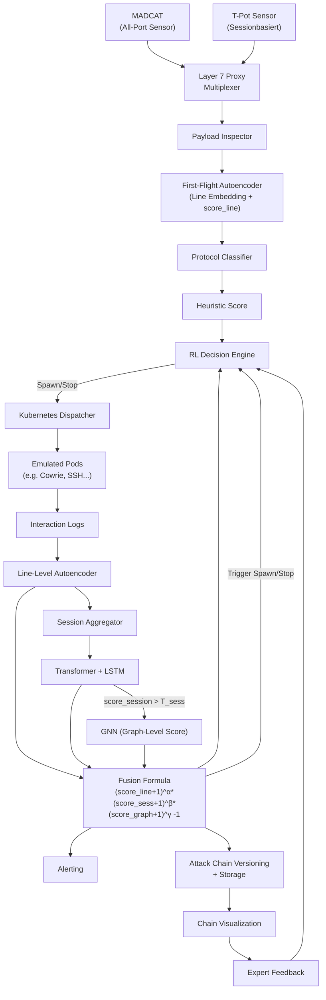

# **Adaptives Multi-Layer Honeynet-Framework mit nichtlinearer Anomaliefusion und Angriffsketten-Versionierung für ressourcensensitive Bedrohungsanalyse**

---

## **Abstract**

Unüberwachte Anomalieerkennung und die Rekonstruktion von Angriffsketten in großskaligen Honeypot-Infrastrukturen gehören zu den ungelösten Kernproblemen der Cybersicherheitsforschung. Bestehende Systeme bieten entweder keine adaptive Orchestrierung, ignorieren kontextuelle Verhaltensebenen oder vernachlässigen Ressourcenaspekte. Das hier vorgestellte modulare, KI-gesteuerte Framework kombiniert Line-Level-Autoencoder, Session-basierte Transformer-LSTM-Modelle und Graph-basierte GNNs zur Detektion komplexer Angreiferverhalten in unstrukturierten Logs. Eine nichtlineare Fusionsformel aggregiert Anomaliesignale synergetisch, während ein Reinforcement-Learning-Modul Containerdienste dynamisch in Abhängigkeit von Interaktionsqualität und Ressourceneinsatz steuert. Die Architektur ermöglicht eine Versionierung von Angriffsketten, adaptive Emulation und eine hohe Interpretierbarkeit. Evaluierungen gegen lineare Fusion und Max-Pooling zeigen signifikante Präzisions- und Effizienzgewinne.

---

## **1. Einleitung**

Die Detektion von Anomalien in hochvolumigen Honeypot-Logs sowie die extraktive Darstellung von Angriffsketten stellen zwei der relevantesten und zugleich am wenigsten gelösten Herausforderungen der sicherheitsbezogenen KI dar. Besonders Systeme wie **MADCAT** und **T-Pot** erzeugen große Mengen unstrukturierter, unlabeled Daten, in denen sich triviale Scans und mehrstufige APT-Vorstufen vermischen.

**Beispielhafte Schwäche bestehender Systeme**: Ein mehrstufiger SSH-Brute-Force-Angriff mit anschließender lateralem Reconnaissance erscheint in einzelnen Containern, bleibt aber semantisch unverbunden. Statische Emulation lässt keine Kontextanreicherung zu, regelbasierte Alarme erfassen keine neue Angriffsdynamik.

Dieses Framework greift diese Defizite auf und bietet eine mehrschichtige Architektur, die:

- **First-Flight-Ereignisse** aus All-Port-Sensorik analysiert,  
- **Containerdienste dynamisch emuliert**,  
- **Anomalien auf Zeilen-, Sitzungs- und Graph-Ebene erkennt**,  
- und **Angriffsketten versioniert** (zeitlich, semantisch, strukturell).  

---

### **Beitrag des Frameworks**

Dieses Konzept umfasst folgende Kernbeiträge:

1. Eine **mehrschichtige Anomaliearchitektur** für unlabeled Honeypotdaten auf Basis von Autoencoder, Transformer-LSTM und GNN.  
2. Ein **nichtlineares Fusionsmodell**, das synergetisches Anomalieverhalten über alle Analyseebenen aggregiert.  
3. Ein Verfahren zur **Angriffsketten-Versionierung**, das temporales Clustering und Graphpartitionierung kombiniert.  
4. Ein **ressourcenbewertender RL-Agent**, der Container dynamisch orchestriert.  
5. Eine **Vergleichsevaluation** gegenüber linearen und max-basierten Fusionsmethoden sowie eine quantitative Messung des RL-Einflusses auf CPU-, RAM- und Speicherauslastung im Cluster.  

---

## **2. Verwandte Arbeiten**

Dieses Framework positioniert sich im Spannungsfeld zwischen Honeypot-Emulation, unüberwachter Anomalieerkennung, Graphmodellierung von Angreiferverhalten und adaptiver Orchestrierung:

- **T-Pot**: Bietet containerisierte Honeypots (Cowrie, Dionaea), jedoch ohne dynamische Steuerung oder KI-Integration.  
- **MADCAT**: Zeichnet All-Port-Logs auf, bietet jedoch keine Interaktionssimulation oder ML-basierte Analyse.  
- **DeepLog [Du et al., 2017]**: LSTM-basiert, jedoch auf strukturierte Einzelsitzungen begrenzt.  
- **AutoLog [Xia et al., 2021]**: Templatefreier Autoencoder für Logs, ohne Sitzungs- oder Graphmodell.  
- **GraphSAGE, Cluster-GCN**: Skalierbare GNNs, bislang kaum zur Honeypot-Verhaltensanalyse eingesetzt.  
- **UNADA, DeepFed (2023)**: Unüberwachte Modelle für Netzwerkdaten ohne interaktive Emulation.  
- **Explainable AI (XAI)**: Tools wie GNNExplainer für Interpretierbarkeit, bisher nicht im Honeypotkontext eingesetzt.  

Ein integriertes System, das mehrschichtige Detektion, RL-gesteuerte Containersteuerung und versionierte Angriffsgraphen kombiniert, ist bisher nicht bekannt.

---

## **3. Mathematische Modellierung**

**Notation & Definitionen:**

- \( L = \{l_1, l_2, \dots, l_n\} \): Menge aller Logzeilen  
- \( S = \{s_1, s_2, \dots, s_m\} \): Menge aller Sessions, \( s_j \subseteq L \)  
- \( e_{l_i} \in \mathbb{R}^d \): Embedding der Logzeile \( l_i \) mittels Autoencoder  
- \( e_{s_j} \in \mathbb{R}^h \): Sitzungsembedding von \( s_j \) über Transformer-LSTM  
- \( G = (V, E) \): Graph mit Sitzungen als Knoten und Kanten für semantische und zeitliche Nähe  
- \( e_G \in \mathbb{R}^k \): Graphembedding mittels GNN  

---

### **Nichtlineare Score-Fusion (Synergieformel)**

$$
\text{score}_{\text{fusion}}(s_j) = \left[(\text{score}_{\text{line}} + 1)^\alpha \cdot (\text{score}_{\text{session}} + 1)^\beta \cdot (\text{score}_{\text{graph}} + 1)^\gamma \right] - 1
$$

Mit:  
- \( \alpha, \beta, \gamma \in \mathbb{R}^+ \): Gewichtungsparameter der Analyseebenen  

**Vergleichsmodelle für Benchmarking:**  
- Lineare Mittelung:  
  $$ \frac{1}{3}(s_\text{line} + s_\text{session} + s_\text{graph}) $$  
- Max-Pooling:  
  $$ \max(s_\text{line}, s_\text{session}, s_\text{graph}) $$  

---

### **Reward-Funktion des RL-Moduls**

- \( D_{\text{neu}}(s_j) \): Anzahl der neuartigen Daten (gemäß Neuigkeitsmetriken)  
- \( D_{\text{gesamt}}(s_j) \): Gesamtdatenmenge der Sitzung  
- \( T_{\text{runtime}} \): Laufzeit des zugehörigen Containers  
- \( T_{\text{max}} \): Maximale erlaubte Laufzeit  
- \( \lambda_1, \lambda_2 \): Gewichtungsparameter für Informationsgewinn vs. Ressourcenverbrauch  

$$
R(s_j) = \lambda_1 \cdot \frac{D_{\text{neu}}(s_j)}{D_{\text{gesamt}}(s_j)} - \lambda_2 \cdot \frac{T_{\text{runtime}}}{T_{\text{max}}}
$$

---

## **4. Systemarchitektur und Datenfluss**

Die Architektur folgt einer modularen Pipeline, die alle Analyse-, Emulations- und Entscheidungsprozesse entkoppelt:

1. **Sensorik**: Daten stammen aus MADCAT (All-Port) und T-Pot (z. B. Cowrie, Dionaea).  
2. **Frühanalyse**: Logzeilen werden mit Autoencoder codiert, Protokolle klassifiziert und bewertet.  
3. **RL-Entscheidungslogik**: Auf Basis des Heuristikscores entscheidet ein RL-Agent über das Starten/Stoppen von Containern.  
4. **Emulation & Logging**: Container erzeugen Interaktionsdaten, die iterativ weiterverarbeitet werden.  
5. **Multi-Layer Analyse**: Session-Aggregation → Transformer-LSTM → GNN → Score-Fusion.  
6. **Versionierung**: Anomal verdächtige Sitzungen werden in Ketten gruppiert, versioniert und visualisiert.  
7. **Feedback**: Analysteneinschätzungen fließen zurück in RL-Modul.

---

## **5. Visualisierter Datenfluss (Mermaid)**

---

## **6. Evaluation**

| Komponente     | Bewertungsmetrik                                 | Beschreibung |
|----------------|--------------------------------------------------|--------------|
| Autoencoder    | ROC-AUC, PR-AUC, FPR                             | Zeilenbasierte Anomalieklassifikation |
| Transformer-LSTM | Clustering Silhouette, Session-Timing Recall | Konsistenz und Präzision der Session-Zusammenfassungen |
| GNN            | Modularity, Edge Activation Ratio                | Qualität der graphbasierten Verhaltenscluster |
| Fusion-Modul   | Synergy Gain, Vergleich zu linearen Methoden     | Vorteil der nichtlinearen Kombination |
| RL-Policy      | Reward-Stabilität, Ressourcen-/Informationsverhältnis | Effizienz der RL-Entscheidungen |
| Versionierung  | Versionsdrift, False-Splits                      | Güte der Verhaltensversionierung (semantische Kohärenz) |

---

## **7. Fazit**

Das vorgestellte Framework demonstriert eine neuartige Verbindung aus modularer KI-gestützter Anomalieerkennung, dynamischer Containeremulation und strukturierter Angriffskettenanalyse. Durch die Kombination aus Autoencoder, sequenzieller Modellierung und graphbasierter Kontextanreicherung entsteht eine anpassungsfähige, interpretierbare Architektur mit hoher praktischer Relevanz.

Insbesondere die Einbindung eines ressourcenbewussten RL-Agenten ermöglicht es, Containerdienste gezielt auf Basis ihres erwartbaren Informationsgewinns zu starten oder zu stoppen – was langfristig einen skalierbaren Betrieb erlaubt.

---

## **8. Ausblick**

Zukünftige Erweiterungen könnten sein:

- Integration mit **Threat Intelligence Plattformen** (z. B. MISP, STIX).  
- Entwicklung eines **Live-Dashboards** für Analytiker zur Echtzeitbewertung.  
- Einsatz von **federated learning**, um Honeynet-Cluster standortübergreifend zu trainieren.  
- Ausbau des Systems zu einem **aktiven Täuschungssystem** („Deceptive Defense“).  
