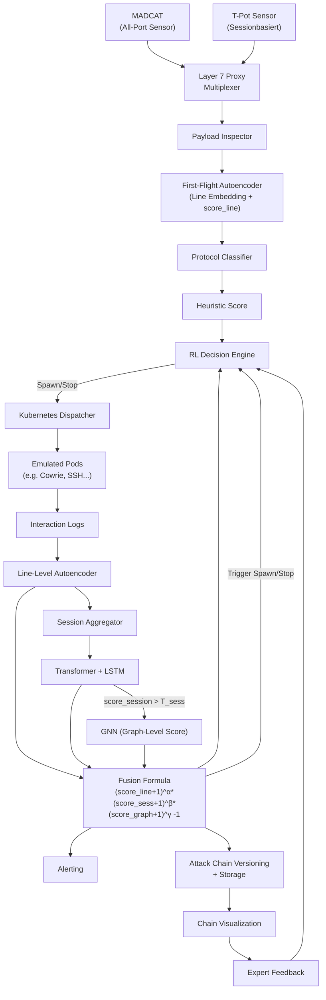

# Adaptive Multi-Layer Honeypot-Architektur mit nichtlinearer Anomaliefusion und Angriffsketten-Versionierung  
*Ein ressourceneffizientes Framework zur Analyse komplexer Angreiferverhalten auf unlabeled Honeypot-Daten*

---

**Diese Konzeption wurde mit Hilfe von Generative AI (ChatGPT 4o, April 2025) erstellt.**

---

## 1. Verwandte Arbeiten und Positionierung

Dieses Framework adressiert Forschungslücken, die in der aktuellen Literatur zu Honeypots, Anomalieerkennung und adaptiver Emulation deutlich werden:

- **T-Pot Honeypot-Plattform**: Bietet diverse Containerdienste (Cowrie, Dionaea), jedoch ohne dynamische Orchestrierung oder ML-gesteuerte Auswertung.  
- **MADCAT (BSI)**: Realisiert eine All-Port-Sensorik, die alle Ports auf eingehenden Verkehr prüft, jedoch ohne interaktive Dienste oder ML-Analyse.  
- **DeepLog (2017)**: LSTM-basiertes Modell für sequentielle Log-Anomalien, aber limitiert auf strukturierte Einzel-Sessions.  
- **AutoLog (2021)**: Templatefreier Autoencoder für Systemlogs, ohne Session- oder Graphmodellierung.  
- **GraphSAGE / Cluster-GCN**: Skalierbare GNNs, bislang selten zur Analyse von Honeypot-Verhalten über mehrere Sessions hinweg genutzt.  
- **UNADA / DeepFed (2023)**: Unsupervised Anomalieerkennung in Netzwerkdaten, jedoch ohne containerisierte Emulation oder orchestrierte Interaktion.  
- **Explainable AI in Cybersecurity**: Wichtig für Nachvollziehbarkeit – z. B. GNNExplainer, aber bislang kaum auf Honeypots angewendet.

**Beitrag dieses Frameworks:** Kombination von All-Port-Logging, Autoencoder, Sessionmodellierung, GNN, RL-Steuerung und Angriffsketten-Versionierung – unter Berücksichtigung von Ressourcen und Kontext.

---

## 2. Einleitung

Die Erkennung von Anomalien in großvolumigen Honeypot-Daten und die Rekonstruktion von Angriffsketten gehören zu den wichtigsten, aber zugleich am schlechtesten gelösten Herausforderungen in der sicherheitsorientierten KI. Gerade **unstrukturierte Logs**, wie sie in Honeypot-Systemen wie **MADCAT** oder **T-Pot** erzeugt werden, sind schwer zu modellieren: sie sind unlabeled, hochdivers, und enthalten sowohl triviale Scans als auch mehrstufige APT-Vorstufen.

Dieses Paper schlägt eine vollständig modulare Architektur vor, die:

- **First-Flight-Daten von All-Port-Sensoren analysiert**,  
- **Dienste dynamisch emuliert**,  
- **Anomalien auf drei Ebenen erkennt** (Line, Session, Graph),  
- und **Attack Chains versioniert** – unter Einbindung von **Ressourcenkosten** und **Interaktionsqualität**.

---

## 3. Architekturüberblick: Konzeptionelle Erweiterung

### 3.1 Schlüsselaspekte des Frameworks

(1) **Line-Level Modellierung**  
Ein schlanker Denoising-Autoencoder extrahiert aus First-Flight-Logzeilen einen Embedding-Vektor und berechnet einen Rekonstruktionsfehler als Anomaliescore.

(2) **Session-Level Modellierung**  
Ein Transformer-LSTM-Modul erfasst sowohl lokale Sequenzstruktur als auch globalen Kontext einer Session. Zeilenembeddings werden zu einer Sessionrepräsentation aggregiert.

(3) **Temporale Beziehungsmodellierung**  
Dynamische Sessiongraphen modellieren semantische und zeitliche Nähe. Kanten gewichten Ähnlichkeiten und Zeitdifferenzen, um Multi-Session-Angriffe zu identifizieren.

(4) **Graph Neural Network Layer**  
Ein skalierbares GNN (z. B. GraphSAGE) konsolidiert Sessioneinbettungen, erkennt Cluster und APT-ähnliche Kampagnen. Subgraph-Sampling begrenzt Ressourcenlast.

(5) **Fusion Layer mit Synergieformel**  
Ein nichtlineares Fusionsmodell kombiniert:

- Line-Level-Score (AE)  
- Session-Score (Transformer)  
- Graph-Score (GNN)  

zu einem Gesamtscore, der bei gleichzeitiger Anomalieerkennung exponentiell wächst.

(6) **Attack Chain Extraktion & Versionierung**  
Ein zweistufiges Verfahren identifiziert Angriffsketten: temporales Clustering (z. B. DBSCAN), gefolgt von Community Detection (z. B. Leiden). Sessions werden versioniert, wenn ihr Verhalten signifikant vom bisherigen abweicht.

(7) **RL-gesteuerte Container-Orchestrierung**  
Container-Spawn und -Stop erfolgen auf Basis eines Rewards, der den Informationsgewinn durch Angreiferinteraktion gegen Ressourcenaufwand abwägt.

---

## 4. Mathematischer Hintergrund

### 4.1 Problemformulierung

- **Logzeilenmenge**  
  \( L = \{l_1, l_2, \dots, l_n\} \)

- **Session-Gruppierung**  
  \( S = \{s_1, s_2, \dots, s_m\} \)

- **Zeilen-Embedding**  
  \( e_{l_i} \in \mathbb{R}^d \)

- **Session-Embedding**  
  \( e_{s_j} = \text{TransformerLSTM}(s_j) \)

### 4.2 Nichtlineare Score-Fusion (Synergieformel)

\[
\text{score}_{\text{fusion}}(s_j) = \left[(\text{score}_{\text{line}} + 1)^\alpha \cdot (\text{score}_{\text{session}} + 1)^\beta \cdot (\text{score}_{\text{graph}} + 1)^\gamma \right] - 1
\]

### 4.3 Reward-Funktion für RL-Agenten

\[
R(s_j) = \lambda_1 \cdot \frac{D_{\text{neu}}(s_j)}{D_{\text{gesamt}}(s_j)} - \lambda_2 \cdot \frac{T_{\text{runtime}}}{T_{\text{max}}}
\]

---

## 5. Datenquellen und Verarbeitungspfad

- **MADCAT / BSI First-Flight Logs**  
  (JSON-basiert, keine Sessionkontexte)

- **T-Pot Session Logs**  
  (z. B. Cowrie SSH-Kommandosequenzen – ideal zum Vortraining)

- **KDD Cup / NSL-KDD**  
  (für gezielte Evaluation bekannter Klassen)

**Verarbeitungskette:**

---

## 6. Evaluation

| Komponente     | Metrik                              |
|----------------|--------------------------------------|
| Autoencoder    | ROC, PR-AUC, False Positive Rate     |
| Sessionmodell  | Clustering Silhouette, Timing Recall |
| GNN            | Cluster-Modularität, Edge Activation |
| Fusion         | Vergleich linear vs. synergistisch   |
| RL-Policy      | Reward-Stabilität, Containerausbeute |
| Versionierung  | Versionsdrift, False-Splits          |

---

## 7. Fazit

Das vorgeschlagene Framework bietet ein hochdynamisches, modulares System zur Angreiferverhaltensanalyse. Es kombiniert:

- lineare und sequenzielle Modellierung,
- Graphkontext,
- ressourcensensitive Steuerung,
- und versionierbare Verhaltensketten.

Durch die Einbindung realer Datenquellen (BSI Honeypot, T-Pot) und die klare Trennung von Scoring, Emulation und Versionierung ist es prädestiniert für eine **skalierbare, adaptive Cyberabwehr**.
