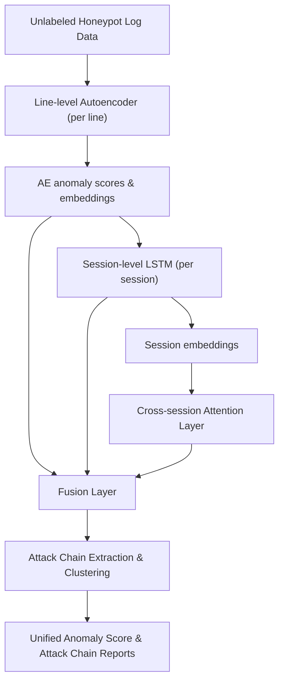

# Unsupervised Multi-Layer Anomaly Detection and Attack Chain Extraction in Unstructured Honeypot Logs  
*A Hybrid Deep Learning Framework for Modeling Complex Attacker Behavior on Unlabeled Production Data*  

## 1. Introduction  

Honeypot systems are widely deployed in cybersecurity research and defense operations to attract and record attacker behavior in controlled environments. These systems generate large volumes of highly unstructured, noisy, and heterogeneous log data. Detecting anomalies within these logs is crucial for identifying stealthy or previously unknown attacks. However, this task becomes significantly more complex when working with unlabeled production datasets, such as the one provided by the German Federal Office for Information Security (BSI), where no predefined ground truth or attack annotations are available.  

This paper presents a novel unsupervised framework designed to not only detect anomalous behavior in unstructured honeypot logs but also to autonomously reconstruct potential attack chains by grouping related sessions and log entries. Our approach addresses both detection and interpretability challenges in environments where labeling is impractical or impossible.  

## 2. Related Work and Research Gap  

- **DeepLog (2017)** models log sequences with LSTMs but relies on structured templates and does not scale to unstructured or cross-session patterns.  
- **AutoLog (2021)** uses autoencoders for anomaly detection but ignores temporal and cross-session relationships.  
- **LogBERT (2021)** applies transformer-based sequence modeling but depends on predefined templates and does not handle multi-session attacker behavior.  
- Clustering-based methods (UNADA, DBScan on NetFlow) detect attack patterns but focus on flow-level metrics and do not leverage deep embeddings from log content.  

> **Identified Research Gap:**  
> To date, no unsupervised framework exists that:  
> - Operates on unstructured, unlabeled honeypot log data,  
> - Models attacker behavior across line-level, session-level, and cross-session layers,  
> - And extracts coherent attack chains from anomaly signals without ground-truth annotations.

## 3. Research Objectives  

- **Develop** a hybrid deep learning framework that integrates:  
  - Line-level autoencoder for anomaly detection in individual log entries,  
  - Session-level sequential modeling using LSTM to detect abnormal behavior patterns within sessions,  
  - A cross-session attention layer to detect distributed attacker strategies over multiple sessions.  

- **Address the absence of labeled data** by:  
  - Operating fully unsupervised,  
  - Using anomaly scores and embeddings to autonomously cluster sessions and reconstruct attack chains.  

- **Enable explainability and analyst support** by:  
  - Providing log line-level anomaly scores,  
  - Visualizing attention weights across sessions,  
  - Outputting clustered groups of logs and sessions that constitute suspected attack chains.  

## 4. Proposed Framework Architecture  

### Key Components:
- **Line-level Autoencoder:** Detects content anomalies in individual log lines.  
- **Session-level LSTM:** Captures sequential behavior anomalies within each session.  
- **Cross-session Attention Layer:** Aggregates and highlights patterns across multiple sessions.  
- **Fusion Layer:** Combines all anomaly signals.  
- **Attack Chain Extraction:** Uses embeddings and attention scores to cluster sessions into coherent attack chains.  

## 5. Methodology  

### 5.1 Data Preparation  
- Parse unstructured honeypot log data into log lines and sessions based on connection metadata and time windows.  
- No labeling or manual annotation is performed.  

### 5.2 Line-Level Anomaly Detection  
- Use an autoencoder trained on "normal" patterns to compute reconstruction errors and anomaly scores for each log line.  
- Optionally incorporate embeddings (Word2Vec or SentenceBERT) to capture semantic similarity.  

### 5.3 Session-Level Modeling  
- Feed sequences of embeddings and AE scores into an LSTM to detect abnormal session-level behaviors.  
- Extract session embeddings from the final LSTM hidden state.  

### 5.4 Cross-Session Attention Modeling  
- Aggregate session embeddings over time and feed them into a self-attention model to detect distributed attack patterns spanning multiple sessions.  

### 5.5 Attack Chain Extraction  
- Use either clustering (e.g., HDBSCAN) or thresholding on attention scores to group sessions that likely form part of the same attack chain.  
- Output full log sequences for each identified chain.  

## 6. Evaluation Plan  
- **Datasets:**  
  - BSI unlabeled honeypot production dataset, supplemented with synthetic anomaly injections for quantitative evaluation.  
- **Metrics:**  
  - Precision, recall, F1-score, false positive rate (evaluated on synthetic injections).  
  - Qualitative analysis via attention heatmaps and attack chain visualizations.  
- **Baseline comparisons:**  
  - DeepLog, AutoLog, isolation forest, and clustering-based detection methods.  

## 7. Contributions  

- The first unsupervised, multi-layer anomaly detection framework for unstructured honeypot logs.  
- Novel attack chain extraction capability, clustering related sessions without labels.  
- Practical applicability demonstrated on production BSI datasets.  
- Open-source release with code and synthetic reproducibility framework.  
- Visual analytics for explaining detected anomalies and attack chains.  

## 8. Future Work: Toward Adaptive Honeypot Systems  

While this work focuses on detection and attack chain extraction, an exciting avenue for future research is the development of **adaptive honeypot systems**.  
By leveraging detected attack chains, future honeypots could dynamically adjust their configuration to gather deeper insights into attacker behavior. Potential adaptive mechanisms include:  
- Automatically extending session durations when suspicious sequences are detected.  
- Modifying system responses and banners to appear more vulnerable and provoke attacker exploration.  
- Deploying synthetic artifacts (e.g., fake directories or credentials) that trigger additional attacker actions.  

Such adaptations could be guided by session embeddings and attention scores, integrated into a reinforcement learning loop where the system's "reward" is the collection of richer or novel attacker behaviors. Although this concept is beyond the current scope, the architecture presented here lays the foundation for adaptive, intelligence-gathering honeypots in future work.

## 9. Conclusion  

This work proposes a hybrid deep learning architecture that not only detects anomalies in unlabeled, unstructured honeypot logs but also autonomously extracts full attack chains across sessions and time. By combining line-level autoencoders, session-level LSTMs, and cross-session attention mechanisms, the system provides interpretable and actionable detection capabilities for real-world security monitoring. The attack chain clustering component further enables security analysts to reconstruct attacker narratives from noisy data, opening the door to future adaptive honeypot strategies that respond dynamically to attacker behavior.
