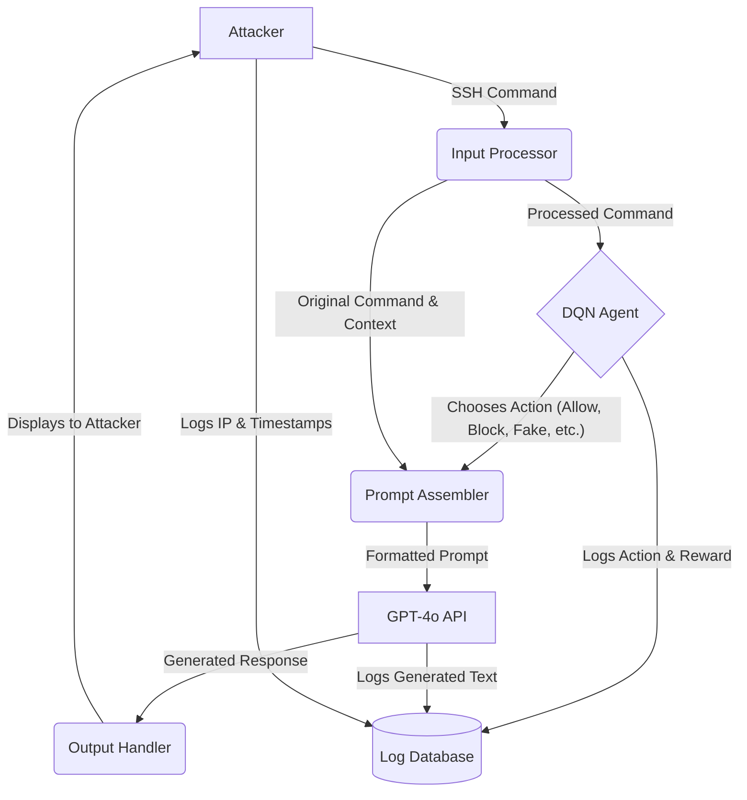

# Analysis of "Generative AI SSH Honeypot With Reinforcement Learning"

This document provides a comprehensive summary and analysis of the paper "Generative AI SSH Honeypot With Reinforcement Learning" by Prasad et al.

## Paper Summary

The paper introduces **GASH (Generative AI SSH Honeypot)**, a novel honeypot architecture that integrates a Large Language Model (LLM) with a Deep Reinforcement Learning (DRL) agent to create a highly interactive and adaptive SSH honeypot. The primary goal is to overcome the static and predictable nature of traditional honeypots, thereby increasing attacker engagement and gathering more detailed threat intelligence.

### Core Components

#### 1. Generative AI

*   **Technology Used:** The system explicitly uses **OpenAI's GPT-4o model**. This is a state-of-the-art Large Language Model (LLM) accessed via an API.
*   **Role in the Honeypot:** The LLM's primary function is **dynamic response generation**. Instead of relying on a fixed set of pre-scripted replies, GASH sends attacker commands, along with session context and a defined "personality," to the GPT-4o model. The model then generates a contextually appropriate and realistic output for the SSH shell. This includes:
    *   Simulating command outputs (e.g., generating a believable file listing for `ls`).
    *   Creating realistic error messages.
    *   Handling unexpected or complex user inputs in a human-like manner.
    *   Maintaining a consistent persona to enhance the illusion of a genuine system.

#### 2. Reinforcement Learning

*   **Technology Used:** The RL component is a **Deep Q-Network (DQN)**, a DRL algorithm well-suited for decision-making in environments with large state spaces.
*   **Role in Guiding the AI:** The DQN agent acts as the honeypot's "brain" or policy engine. It does not generate content but instead decides *how* the honeypot should respond to an attacker's command at a strategic level.
*   **State Space:** The state is derived from the current session context, including the sequence of attacker commands and system parameters.
*   **Action Space:** The RL agent chooses one of five distinct strategic actions for any given attacker command:
    1.  `allow`: Permit the command and generate a standard response.
    2.  `block`: Deny the command execution.
    3.  `delay`: Introduce a realistic processing delay before responding.
    4.  `fake`: Provide a fabricated or deceptive output.
    5.  `insult`: A "Reverse Turing Test" mechanism to issue a taunting or unusual response, designed to differentiate human attackers from automated bots.
*   **Reward Function:** The reward structure is designed to maximize attacker engagement (dwell time) while maintaining security.
    *   **Positive Rewards:** Awarded for actions that prolong the session or correctly handle risky commands (e.g., blocking a "high-risk" command like `shutdown`).
    *   **Negative Rewards (Penalties):** Applied when the agent's action causes the attacker to disconnect, when it incorrectly allows a dangerous command, or when the attacker identifies the system as a honeypot.

#### 3. Architecture

GASH's architecture integrates the components in a sequential flow:

1.  **Attacker Interaction:** An attacker connects to the SSH honeypot and issues a command.
2.  **Input Processing:** The command is captured, cleaned, and tokenized.
3.  **RL Decision-Making:** The processed command is fed to the **DQN agent**, which evaluates the current state and selects the most optimal strategic action (e.g., `fake`).
4.  **Generative Response:** The original command, the agent's chosen action, and the session context are bundled into a prompt and sent to the **GPT-4o API**.
5.  **Output Display:** The LLM generates a realistic response based on the prompt, which is then displayed to the attacker in the SSH terminal.
6.  **Logging:** All interaction data (IP, command, RL action, LLM response, timestamp) is logged for analysis.

### Relevance to Thesis

The GASH model presents a compelling evolution of honeypot technology that aligns directly with the goals of the **ADLAH (Adaptive Multi-Layered Honeynet Architecture)**. Its integration would significantly advance ADLAH's capabilities, particularly in the `Sensor Layer`.

#### Enhanced Deception and Intelligence

By replacing static, low-interaction honeypots with a GASH-like system, ADLAH could offer a far more believable and engaging environment. Attackers are more likely to reveal their true intentions, tools, and skill levels when they believe they are interacting with a real, complex system. This leads to:
*   **Longer Dwell Times:** Increased interaction time allows for more comprehensive data collection.
*   **Higher-Quality Intelligence:** Observing advanced attacker techniques, rather than just automated scans, provides more valuable insights for threat modeling and defense adaptation.

#### Dynamic Virtual Environments

The core principle of GASH—using a generative model—can be extended beyond shell responses. Theoretically, this approach could enable ADLAH to **dynamically generate entire virtual environments on the fly**. Instead of just faking a command's output, a more advanced a GASH-like sensor could:
*   Generate a complete, coherent, but entirely fictional file system.
*   Simulate running processes and network services.
*   Create bespoke user accounts and activity histories.
This would allow ADLAH to deploy honeypots that are not only realistic but also uniquely tailored to the perceived profile of an attacker, making fingerprinting nearly impossible.

#### Integration with ADLAH's Central RL Agent

The integration between ADLAH's central `Hive Layer` agent and a local GASH sensor would create a powerful hierarchical reinforcement learning structure.

*   **Hierarchical Policy Control:** The `Hive Layer` agent, which has a global view of the entire honeynet, would not micromanage individual command responses. Instead, its policy would set high-level strategic goals for the `Sensor Layer`. For example, based on intelligence from other sensors, the central agent could instruct a GASH instance to:
    *   **"Act as a misconfigured web server."**
    *   **"Simulate an unpatched IoT device."**
    *   **"Adopt a paranoid administrator persona to frustrate the attacker."**
*   **Policy to Persona:** The GASH sensor's role would be to translate this high-level directive into a concrete "personality" file and context for its LLM. The local DQN agent within GASH would then optimize for engagement *within the parameters of that persona*.
*   **Feedback Loop:** The detailed intelligence gathered by the GASH sensor (e.g., "the attacker is attempting to exploit CVE-2025-XXXX") would be fed back to the `Hive Layer`. This new information would update the central agent's global state, allowing it to adapt its strategy across the entire honeynet in response.

This creates a clean separation of concerns: the `Hive` manages high-level strategy, while the `Sensor` executes low-level, adaptive tactics.