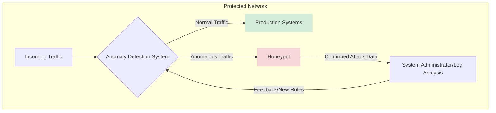

# Analysis of "Hybrid System Between Anomaly Based Detection System and Honeypot to Detect Zero Day Attack"

## Summary of the Proposed Architecture and Workflow

This paper by Innab, Alomairy, and Alsheddi proposes a hybrid security model that integrates an **Anomaly-Based Detection System (ADS)** with a **honeypot** to improve the detection of zero-day attacks. The core idea is to leverage the strengths of each component to compensate for the other's weaknesses.

### The Hybrid Architecture

The proposed architecture, illustrated in Figure 6 of the paper, outlines a collaborative workflow:

1.  **Initial Traffic Flow:** All incoming network traffic first passes through the ADS.
2.  **Anomaly Detection:** The ADS monitors the traffic, establishing a baseline of normal network behavior. When it detects a deviation from this baseline—a potential anomaly—it triggers an alert.
3.  **Redirection to Honeypot:** Instead of simply blocking the suspicious traffic (which could be a false positive), the system redirects the traffic associated with the anomalous activity to a honeypot.
4.  **Honeypot Interaction:** The honeypot, an isolated and monitored environment, engages with the potential attacker. It is designed to look like a real system to lure the attacker into revealing their tools, techniques, and intent.
5.  **Confirmation and Analysis:** All interactions within the honeypot are considered malicious by default. The honeypot's logs provide definitive proof of an attack, thus validating the initial alert from the ADS. This process effectively eliminates the false positives that often plague standalone ADS implementations.
6.  **Feedback Loop (Implied):** The detailed attack data captured by the honeypot can be used to refine and update the ADS's understanding of malicious behavior, creating a feedback loop that strengthens the system's detection capabilities over time.

### The Role of the Anomaly-Based Detection System (ADS)

The paper describes the ADS as a system that learns the normal behavior of the network to identify unknown attacks (`HybridSystemBetweenAnomalyBasedDetectionSystemandHoneypottoDetectZeroDayAttack.pdf:179`). It does not specify a single technique (e.g., statistical or ML-based) but rather defines its function by its objective: to flag activities that do not conform to the established baseline. The primary weakness of a standalone ADS is its propensity for a **high rate of false positives** (`HybridSystemBetweenAnomalyBasedDetectionSystemandHoneypottoDetectZeroDayAttack.pdf:252`), which the hybrid model aims to solve.

### The Role of the Honeypot

The honeypot serves two critical functions in this architecture:

1.  **Alert Validation:** Its primary role is to act as a verification environment. By redirecting suspicious traffic to the honeypot, the system can confirm whether an anomaly detected by the ADS is a genuine attack or a false alarm.
2.  **Attack Analysis and Data Collection:** As a high-interaction environment, the honeypot is designed to capture detailed information about the attacker's methods. This addresses a key weakness of honeypots noted in the paper: their limited field of view. In this model, the honeypot doesn't wait passively but is actively fed suspicious traffic, making it a targeted instrument for deep analysis.

### Goal: Detecting Zero-Day Attacks

The hybrid approach is specifically effective against zero-day attacks for the following reasons:

*   **Behavior-Based Detection:** Unlike signature-based systems that rely on known attack patterns, the ADS flags *any* unusual behavior, making it capable of identifying novel attack vectors.
*   **High-Fidelity Alerts:** While the ADS can detect new attacks, it often suffers from false positives. By using the honeypot to validate alerts, the system can confidently distinguish between genuine zero-day exploits and benign anomalies. The honeypot interaction turns a low-confidence alert into a high-confidence, actionable security event.
*   **Decoying and Delaying:** The honeypot keeps the attacker occupied in a safe, emulated environment, buying valuable time for defenders to analyze the attack and mount a defense before real systems are compromised (`HybridSystemBetweenAnomalyBasedDetectionSystemandHoneypottoDetectZeroDayAttack.pdf:284`).

---

### Relevance to Thesis

This paper provides a foundational and concrete architectural pattern that directly aligns with the proposed **ADLAH (Adaptive Multi-Layered Honeynet Architecture)**. The hybrid model serves as a practical blueprint for the interaction between key layers within ADLAH.

*   **A Blueprint for ADLAH's Layers:** The paper's model perfectly mirrors the intended relationship between ADLAH's `Post-Interaction Analysis Layer` and its `Sensor Layer`.
    *   The **ADS** in the paper is analogous to ADLAH's **`Post-Interaction Analysis Layer`**, where unsupervised models (like the D-PACK autoencoder) analyze log data to establish baselines and detect behavioral anomalies.
    *   The **honeypot** is the direct equivalent of ADLAH's **`Sensor Layer`**, which consists of various honeypots designed to engage with attackers. This paper validates the core ADLAH concept of using an analytical engine to direct traffic to a sensor for deeper inspection.

*   **Alert Validation and Data Enrichment:** The paper's workflow is precisely what is envisioned for ADLAH. When ADLAH's unsupervised learning models flag a session or an IP as anomalous, the system can use this as a trigger. The `Orchestrator Layer` can then re-route all future traffic from that source to a specific, high-interaction honeypot within the `Sensor Layer`. This achieves two goals: it **validates** that the anomaly is a real threat and **enriches** the data by capturing a more detailed account of the attacker's subsequent actions.

*   **Informing the RL Agent:** The paper's model generates high-confidence attack indicators. An alert from the ADS that is subsequently confirmed by an interaction in the honeypot is not just noise; it is a verified attack. This signal is an ideal input for ADLAH's central **Reinforcement Learning (RL) agent**. Such a high-confidence event can serve as a strong positive reward in the RL model, prompting the agent to learn and execute a more decisive or aggressive strategic response, such as reconfiguring the honeynet to better counter the observed threat profile or even blocking the attacker outright.

*   **Dynamic Rule and Signature Generation:** The paper suggests that "anomaly based detection learns from honeypot results" (`HybridSystemBetweenAnomalyBasedDetectionSystemandHoneypottoDetectZeroDayAttack.pdf:288`). This describes a feedback loop that is central to ADLAH's "adaptive" nature. In ADLAH, the rich, verified attack data captured by the `Sensor Layer` (honeypots) can be fed back into the `Post-Interaction Analysis Layer`. This data can be used to automatically retrain the detection models or even generate new, specific rules and signatures, allowing the entire system to continuously learn from the attacks it observes and improve its own detection capabilities over time.